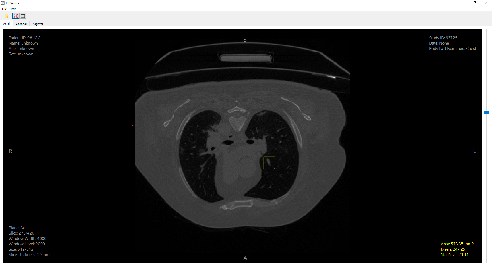
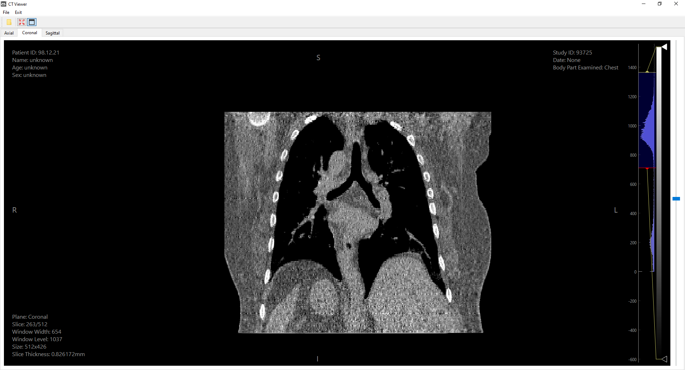
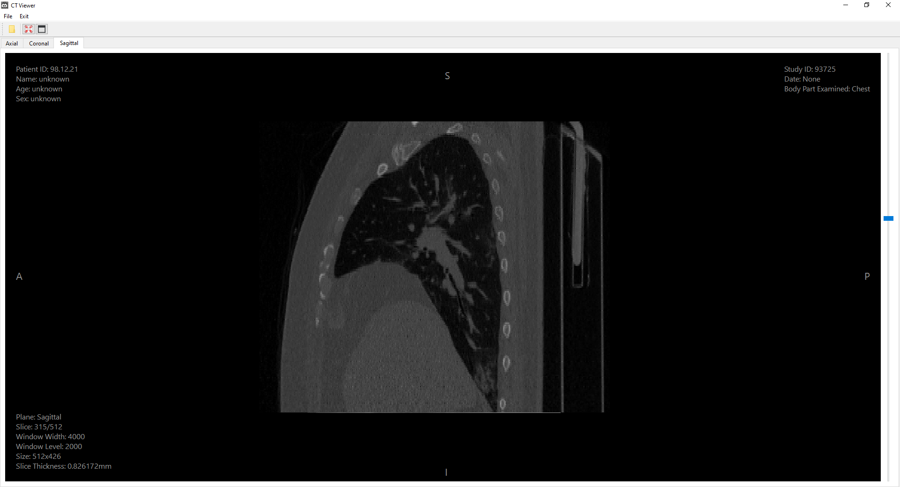

# Computed Tomography Visualizer

### Disclaimer
This app provides only information for educational purposes. This app is not medical or treatment advice, professional diagnosis, opinion, or services – and may not be treated as such by the user. As such, this app may not be relied upon for the purposes of medical diagnosis or as a recommendation for medical care or treatment. The information provided by this app is not a substitute for professional medical advice, diagnosis or treatment.

### General
GUI Python app that allows to visualize CT scan data in three anatomical planes: sagittal, coronal, and axial. The app provides an intuitive interface for exploring CT scan slices. The source of the data is the directory with .dcm files (DICOM is a technical standard that specify storage and transmission of medical data, including .dcm format files).

### Functions
- User can load CT serie by selecting the folder with the CT data volumin (.dicom files that store CT slices); loading data lasts a while.
- After loading the data user can choose specified plane with tab bar (Axial, Coronal, Sagittal) and then navigate between slices of selected plane (slider on the right). 
- Both histogram and ROI modes can be displayed/hidden with button in toolbar (global for all planes).
- Data about current seleced plane and slice is showed in corners of widget which display image.
- ROI mode allows to check basic statistics (mean and standard deviation for pixel values, real area in mm^2) of the selected ROI.

### Demo
CT data used in demo comes from the page: https://3dicomviewer.com/dicom-library (app demo is based on "CT Scan of COVID-19 Lung" data).

### Requirementes 
This app uses **Python 3.8** and packages: **numpy, PySide6, PyQtGraph, pydicom** (all requirements are in requirements.txt file).

App GUI is based on PySide6 (general widgets structure) and PyQtGraph (images displaying). Buisness logic is realised with numpy package (managing slices, computing) and pydicom (extract specified data from .dicom files).

Entrypoint of the app is main.py file which starts the app and display main window of the app.
***

